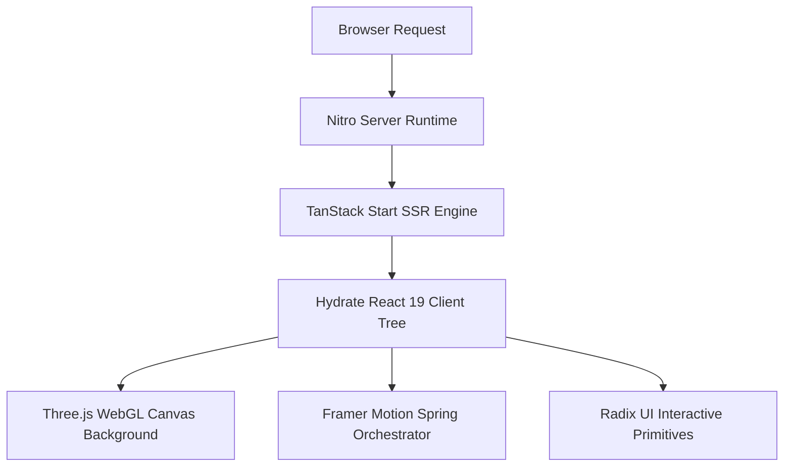

<div align="center">

# Personal Portfolio

**High-performance developer portfolio built with TanStack Start (SSR), React 19, Tailwind CSS v4, Framer Motion, and Three.js 3D visuals.**

[](LICENSE)
[](https://react.dev)
[](https://tanstack.com/start)
[](https://tailwindcss.com)
[](https://threejs.org)

[Report Bug](https://github.com/Justinvcj/Personal_Portfolio/issues) * [Request Feature](https://github.com/Justinvcj/Personal_Portfolio/issues)

</div>

---

```
+-----------------------------------------------------------------------------+
|                    Personal Portfolio Client Experience                     |
|                                                                             |
|  +-----------------------+  +-----------------------+  +-----------------+  |
|  | Grainient WebGL Shader|  | Magnetic Button       |  | PixelCard       |  |
|  | Three.js 3D Canvas    |  | Spring Cursor Physics |  | Retro Mesh FX   |  |
|  +----------+------------+  +----------+------------+  +--------+--------+  |
|             |                          |                        |           |
|             +--------------------------+------------------------+           |
|                                        v                                    |
|  +-----------------------------------------------------------------------+  |
|  | TanStack Start SSR Route Layer * Strict TypeScript * Radix Headless   |  |
|  +-------------------------------------+---------------------------------+  |
|                                        v                                    |
|  +-----------------------------------------------------------------------+  |
|  |  Live Project Hub * Interactive Tech Matrix * Contact Sonner System   |  |
|  +-----------------------------------------------------------------------+  |
+-----------------------------------------------------------------------------+
```

> Most engineering portfolios rely on cookie-cutter site generators with heavy bloated templates and static assets, failing to demonstrate true architectural craftsmanship.
> This portfolio combines full-stack Server-Side Rendering (SSR) through TanStack Start with hardware-accelerated WebGL Three.js shaders, magnetic spring micro-interactions, and accessible Radix UI primitives.

---

## Features

- **Server-Side Rendered Routing** -- Leverages TanStack Start and TanStack Router for instantaneous initial page loads and end-to-end type safety.
- **Hardware-Accelerated 3D Visuals** -- Features custom Three.js WebGL canvas shaders (`Grainient.tsx`) and interactive lighting effects.
- **Physics-Driven Micro-Interactions** -- Delivers fluid layout transitions, magnetic cursor-following buttons (`MagneticButton.tsx`), and scroll progress bars.
- **Retro Component Architecture** -- Custom UI components including glowing pixel cards (`PixelCard.tsx`), infinite marquee tickers, and spring reveal animations.
- **Interactive Project Showcase** -- Displays live repository metrics, categorized technology badges, and direct GitHub links.
- **Accessible Design System** -- Built on headless Radix UI primitives styled with Tailwind CSS v4 design tokens and dark-mode defaults.

---

## How It Works



---

## Quick Start

### Prerequisites

| Requirement | Version | Notes |
|---|---|---|
| [Node.js](https://nodejs.org/) | 18+ (20+ recommended) | JavaScript runtime |
| [npm](https://www.npmjs.com/) | 9+ | Package manager |

### Installation

1. Clone the repository:
   ```bash
   git clone https://github.com/Justinvcj/Personal_Portfolio.git
   cd Personal_Portfolio
   ```

2. Install dependencies:
   ```bash
   npm install
   ```

3. Launch development server:
   ```bash
   npm run dev
   ```

### Production Build & Preview

```bash
npm run build
npm run preview
```

---

## Tech Stack

| Layer | Technology |
|---|---|
| Core Framework | TanStack Start, TanStack Router, TanStack React Query, React 19 |
| Styling & UI | Tailwind CSS v4, Radix UI, Lucide React, Sonner, Vaul |
| Graphics & Animation | Three.js (`three`), Framer Motion |
| Build & Tooling | Vite 8, Nitro, TypeScript 5.8, ESLint, Prettier |

---

## Project Structure

```text
src/
|-- components/
|   |-- ui/               # Radix UI primitives (Dialog, Button, Tooltip, Toggle)
|   |-- Grainient.tsx     # WebGL dynamic canvas gradient shader
|   |-- MagneticButton.tsx# Spring physics magnetic button
|   |-- PixelCard.tsx     # Retro interactive pixel card
|   |-- Projects.tsx      # Flagship project showcase
|   |-- Skills.tsx        # Interactive technical stack matrix
|   |-- HowIThink.tsx     # Engineering principles & mental models
|   `-- Contact.tsx       # Contact form with Sonner toasts
|-- routes/               # TanStack Router type-safe file routes
`-- router.tsx            # Router configuration & SSR hydration
```

---

## License

Distributed under the MIT License. See [LICENSE](LICENSE) for details.